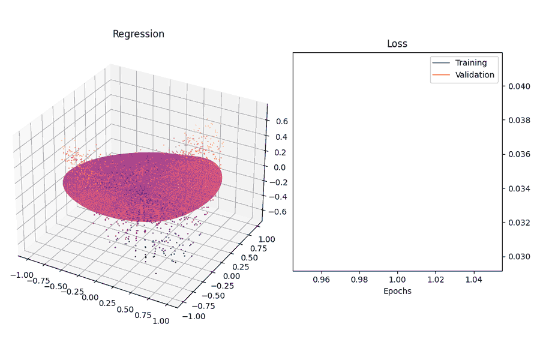
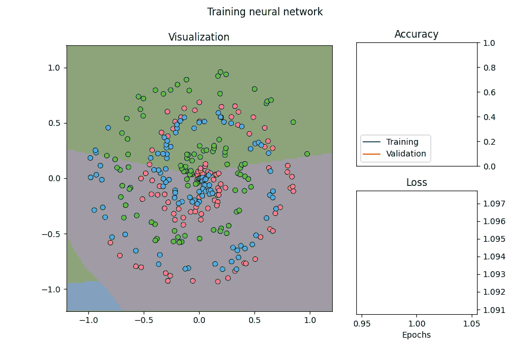

# 🔗 Neural network from scratch

Building and implementing a neural network using libraries such as TensorFlow, PyTorch, or Scikit-learn is straightforward. However, understanding the mechanics can be enhanced by constructing one from scratch.



## Content

### 🧠 Neural Network Layers

- 🔢 Input Layer: Initial data entry layer.
- 🔗 Dense Layers: Fully connected neural layers.
- 🚫 Dropout Layers: Prevent overfitting by randomly dropping units.
- 🎯 Output Layer: Final layer providing the output.
Layers come with forward and backward propagation capabilities, and employ L2 regularization to combat overfitting.


⚙️ Optimizers

- 🔄 SGD (Stochastic Gradient Descent)
- ➕ Adagrad
- 💠 RMSProp
- ⭐ Adam

📊 Data Visualization

The training of models can be monitored using real-time animations, including color and 3D plots.

#### 🗃️ Data Generation

Several functions are used to generate data to test the functionality of the program. They can easily be substituted with real world data.

## Functionality

A neural network model can be constructed and customized based on its components. The training process of the model can be evaluated with an accompanying data visualization.

For example, a classifier can be constructed as follows:

```python
# The classes and their methods are found in the [Modules] folder.
# X, y, X_val, y_val are the training and validation data

# model_0 = Model()
# model_0.add(Layer_Dense(2, 64, weight_regularizer_l2=5e-4, bias_regularizer_l2=5e-4))
# model_0.add(Activation_ReLU())
# model_0.add(Layer_Dense(64, 3))
# model_0.add(Activation_Softmax())

# visualizer = Visualizer(model=model, animate=True, X=X_val, y=y_val, n_inputs=2, n_outputs=3, colorgraph=True, validation=True)

# model_0.set(loss=Loss_CategoricalCrossentropy(), optimizer=Optimizer_Adam(learning_rate=0.01, decay=5e-7), accuracy=Accuracy_Categorical(), visualizer=visualizer)
# model_0.finalize()
# model_0.train(X, y, epochs=1000, validation_data=(X_val, y_val))
```
Output:



```python
>>> Accuracy : 0.86333
>>> Loss     : 0.39588
```  

```
Prediction  : T-shirt/top
T-shirt/top : 0.65
Trouser     : 0.08
Pullover    : 0.069
Dress       : 0.032
Coat        : 0.012
Sandal      : 0.0
Shirt       : 0.143
Sneaker     : 0.0
Bag         : 0.014
Ankle boot  : 0.0
```

## 🚀 Run the Project

```sh
git clone https://github.com/tal7aouy/neural-network
```
Examples for classification and regression are available in `demo.py`. To run it on the Fashion MNIST dataset, first run `mnist_prep.py` to download the data and then `mnist.py` to build the model. After that, run the relevant section of code in `demo.py`.
